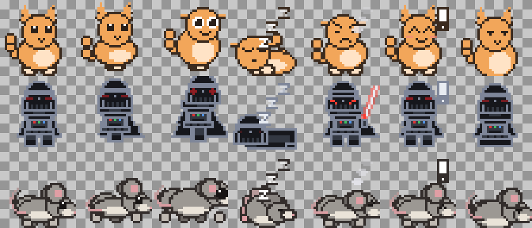

# PetPal

A small animated creature that lives on your Windows desktop. It walks along
the top edges of your windows, rides them when you drag them about, sits on the
taskbar, chases the cursor, shows off the occasional trick, curls up when you
stop typing, gets grumpy when the CPU is pegged, and delivers your reminders.

Four creatures are built in — pick one from the tray menu, or bring your own
sprite sheet. No assets, no runtime, no installer: one ~1 MB executable.



## Try it

[**`petpal.exe`**](petpal.exe) in the repo root is a prebuilt Windows binary —
download and double-click, nothing to install. It writes its settings to
`%APPDATA%\PetPal\` and touches nothing else.

Windows will show a **"Windows protected your PC"** box the first time, because
the binary is unsigned: *More info* → *Run anyway*. Build it yourself if you
would rather not take that on trust — it is one command.

**To quit:** right-click the tray icon → *Exit PetPal*. Closing is the only way
out; the creature has no window to close.

## Building it

```bash
cargo run --release
```

The creature drops onto the desktop and a tray icon appears. Right-click either
one for the menu. Only one copy runs at a time.

## What it does

| Behaviour | How it works |
|---|---|
| **Walks across windows** | Top edges of visible windows become ledges, clipped against anything stacked above them — so it never stands on a title bar that is hidden behind another window. |
| **Rides the window you move** | A ledge remembers which window it came from, so a creature standing on one travels with it — drag the window and it goes along, feet planted, instead of being left in mid-air. It asks the window where it is every frame rather than waiting on the scan, which is far too coarse to follow a drag. Cover the window and it stops riding and drops, as it should. |
| **Stays on top** | `WS_EX_TOPMOST` is a band, not a ranking: whichever always-on-top window asked most recently sits highest, so installers, media players and notification popups used to bury the creature for good. It renews the claim every second, and immediately when a window opens — without ever taking focus. |
| **Sits on the taskbar** | The monitor work area's bottom edge is a ledge, which is exactly the top of the taskbar when you have one. |
| **Hops between windows** | Picks a reachable surface above *or* below and leaps for it, biased by how high it already is so it circulates instead of piling up on the topmost window. A missed leap is just a fall, and it tries again. |
| **Settles in when it arrives** | After reaching a new surface it explores for a few seconds before considering the next move, so a climb up is not followed by an instant hop back down. Restless creatures get bored sooner: roughly 2.5 s at *Constantly*, 8 s at *Hardly ever*. |
| **Climbs window edges** | A taskbar and a large window's title bar are routinely 700px apart — no believable jump covers that, so the creature walks to the window's side and scales it. This is what gets it off the taskbar on a real desktop. |
| **Stays put if you prefer** | **Tray → Jump between windows** off: no hopping, no climbing, no stepping off edges. It roams along whatever surface it is on. |
| **Sprints the whole length** | Sometimes it aims at the far end of whatever it is standing on and runs the entire way, timing the dash to the actual distance — so it crosses the full taskbar rather than twitching a few pixels. |
| **Shows off** | Every 20 seconds or so it stops what it is doing and performs a little trick: crouch, spring, twist, land. A restless creature is slightly likelier to start one but is also busy sprinting and hopping, so the rate stays roughly steady across **Roam**. Clicking it gets one about half the time — the other half is the old delighted reaction, so a poke is worth repeating. |
| **Chases the cursor** | Off by default; toggle it in the tray menu. It will hop up onto a window to reach a cursor that is above it, and step off an edge to reach one below. |
| **Sleeps when idle** | After `sleep_after_idle_secs` with no keyboard or mouse input it walks to a wide ledge and curls up. Any input wakes it. |
| **Reacts to new apps** | When you open an application, the creature turns to face its window, plays its alert animation and pops a tray balloon naming it. A WinEvent hook spots the new top-level window; rate-limited to one reaction every 8 seconds so a burst of windows at login doesn't set it flailing. |
| **Roams as much as you like** | One dial, 0-100, for how often it wanders off on its own versus settling down. **Tray → Roam around**. |
| **Gets annoyed at high CPU** | Above `cpu_annoy_percent` whole-machine load it scowls and steams, with a hysteresis band so it doesn't strobe at the threshold. |
| **Brings reminders** | `[[reminder]]` blocks in the config fire a tray balloon and an alert animation. |
| **Starts with Windows** | **Tray → Start with Windows**. Writes one value to the per-user `Run` key — no elevation, no scheduled task, no shortcut. It is the same entry Task Manager's Startup tab lists, so either can turn it off. |

## Interacting with it

- **Drag** it to pick it up, and let go to throw it — it falls and lands on
  whatever is below.
- **Click** it for a reaction — sometimes a trick.
- **Right-click** it (or the tray icon) for the menu.
- **Double-click the tray icon** to summon it to your cursor.

Clicks land only on the creature's own pixels — the rest of its square window is
click-through, so it never gets in the way.

### The menu stays open

A Windows popup menu normally closes the instant you click anything, which makes
changing three settings a three-right-click chore. This one reopens itself at
the same spot after each change, so checkmarks update in place and you can keep
going. Leave it with **Close menu**, Escape, or a click elsewhere.

One-shot actions still close it: "Come here", "About", the two folder items, and
Exit. Toggles and the Sprite / Size / Roam choices keep it open.

## Switching creatures

**Tray → Sprite** lists the four built-ins plus every sheet you have installed:

- **Pal** — the default blob.
- **Darth Vader** — armour black, red lenses, and he ignites a lightsabre
  instead of steaming when the CPU is pegged.
- **Mouse** — a grey side-view quadruped with a diagonal-pair gait, far-side
  legs in shadow, a pink-cupped ear, whiskers and a tapering tail.
- **Monkey** — long arms, a cream face mask and a prehensile tail, on a wider
  36x32 cell. The only one whose near-side limbs are drawn *over* the body, so
  it can genuinely reach overhead; watch it go up the side of a window.

Each built-in scales the configured speed to suit itself, so they do not all
move like the same creature wearing different clothes: the mouse skitters at
1.7x, the monkey is quick and fidgety at 1.25x, Vader does not hurry at 0.8x.

### Making your own

**Sprite → Add or edit sprites...** opens a window that does the whole job. Drop a PNG
on it and it **fits the sheet to a real grid first** — generator output has its
poses placed by eye, with margins, ground plates and at several times the
resolution the pixel art needs, so slicing it on any cell size cuts creatures in
half. It finds where the poses actually are, re-lays them feet-on-the-bottom-row,
and strips an opaque background if there is one. A sheet already on an exact grid
is left untouched.

Then you click the cells that belong to each animation, in playback order, with
a live preview, and it writes `creature.png` + `sprite.toml` and switches the pet
to it. No frame numbers are typed at any point, which is where hand-written
manifests usually go wrong: an index into an empty cell is not an error, it just
makes the creature invisible.

No sheet yet? **Sheet → Copy AI prompt to clipboard** hands you a prompt that
specifies the layout exactly — one 512x448 image, 8 squares across by 7 down,
each square 64x64 (the cell size PetPal works in), row 1 idle, row 2 walking,
row 3 running, row 7 the trick, the three rows between them split among the
remaining seven animations, facing right, feet on the bottom edge. Paste it into
an image generator, drop the result back on the window, and it fits the grid for
you. Generators that make a mess at that size can be asked for 1024x896 instead
— same grid, scaled down on the way in.
The prompt is extracted from the shipped guide at runtime rather than kept as a
second copy, so the two cannot drift.

**Help → What the controls do** explains every box in terms of its values —
what a number does to the result and how you can tell it was wrong.

The same window edits and deletes what you already have: pick a creature from
the **Installed** dropdown and its artwork, grid and frame assignments load for
changing, or press **Delete** to remove it (after a confirmation that names the
folder and warns it does not go to the Recycle Bin). Deleting the creature the
pet is currently wearing puts it back to Pal.

The same fitting is available as [`sheetconv`](tools/sheetconv/) on the command
line for batches — one implementation, included by both.

**Sprite → Make a copy to edit...** writes the creature you are currently using
out as a real sprite sheet — `creature.png` plus a `sprite.toml` — into
`%APPDATA%\PetPal\sprites\<name>-copy\`, and opens the folder.

That copy is already a working sprite, so you start from a complete, correctly
laid-out sheet instead of an empty grid:

1. **Make a copy to edit...**
2. Open `creature.png` in any pixel editor (Aseprite, Piskel, Paint.NET, even
   Paint if you keep the transparency).
3. Repaint the cells. Keep the grid alignment — the manifest addresses frames by
   number, so you can change one cell or all 60.
4. Rename the folder to whatever you want to call your creature.
5. **Tray → Sprite** and pick it. Already running? **Reload config & sprites**.

The exported manifest lists real frame indices and timings, so every animation
keeps working even if you only repaint a few cells.

Two rules when drawing: **face right** (PetPal mirrors for leftward movement),
and **keep the feet on the bottom row** of each cell, which is the row aligned
with the ground.

Sheets from elsewhere work too — drop any folder with a `sprite.toml` and a PNG
into `%APPDATA%\PetPal\sprites\` and it appears in the menu. No path editing
required.

**[docs/SPRITES.md](docs/SPRITES.md) is the full authoring guide**: grid layout
and frame numbering, the manifest reference, what each of the eleven animations
is for and when it plays, the anchoring rules, and what the error messages mean.
The app drops a copy into the sprites folder on first run, so it is there when
you need it.

## How much it roams

**Tray → Roam around** sets how restless the creature is, from *Hardly ever* to
*Constantly*. It is one number (`roam`, 0-100) driving three things at once:

- the chance that any given decision is to move rather than settle,
- how often it tries to hop up onto a window,
- how long it holds each choice — a calm creature takes long rests, a restless
  one keeps changing its mind.

The menu offers five steps because "how often does it wander" is a feel rather
than a figure; the config file takes any value in the range.

Restlessness also weights how often it picks a **sprint** — aiming at the far
end of its ledge and running the whole way, with the dash timed to the real
distance rather than an arbitrary second or two.

## Configuration

`%APPDATA%\PetPal\config.toml`, created on first run. Edit it and pick
**Reload config & sprites** from the tray menu.

One setting is deliberately *not* in here: **Start with Windows** lives only in
the registry, under `HKCU\Software\Microsoft\Windows\CurrentVersion\Run`. Two
copies of one fact drift the moment anything else touches either — Task Manager
disabling the entry, this file copied to another machine — and then the menu
shows a checkmark that is a lie. The tick is read back from the key each time
the menu opens.

```toml
scale = 3                      # integer upscale: 3 gives a 96px creature
opacity = 255                  # 0-255
speed = 46.0                   # walking speed, px/sec (running is 2.3x)
roam = 45                      # 0-100, how restless it is
chase_cursor = false
walk_on_windows = true
jump_between_windows = true    # off = stays put on one surface
react_to_new_apps = true
sleep_after_idle_secs = 180    # also under Tray > Sleep when idle
cpu_annoy_percent = 80
sprite = "pal"                 # "pal", "vader", "mouse", "monkey", or a sprites\ folder

[colors]                       # optional per-key overrides, built-ins only
body = "#5AA6F2"

[[reminder]]
at = "14:30"
text = "Stand up and stretch"
days = ["mon", "tue", "wed", "thu", "fri"]   # omit for every day
```

Every `[colors]` key is optional and each creature keeps its own palette, so
setting `body` recolours only that — Vader does not inherit Pal's orange.

`days` also accepts `"weekday"` and `"weekend"`. A config file with a syntax
error is never overwritten: the creature runs on defaults, tells you where the
error is, and refuses to save over your edit until you fix it.

## Your own sprites

Drop a folder containing a PNG and a `sprite.toml` into
`%APPDATA%\PetPal\sprites\`. The full guide is
**[docs/SPRITES.md](docs/SPRITES.md)**, a copy of which the app writes to
`sprites\HOW-TO-make-a-sprite.txt` on first run.

```toml
image = "creature.png"
frame_width = 32
frame_height = 32

[anims.idle]
row = 0          # take a whole row...
count = 4
frame_ms = 260

[anims.walk]
frames = [4, 5, 6, 5]   # ...or list frames explicitly
frame_ms = 120
```

The sheet is sliced into a grid numbered left-to-right, top-to-bottom from 0.
Recognised animations are `idle`, `walk`, `run`, `fall`, `sleep`, `annoyed`,
`drag`, `alert` and `sit`; anything you leave out falls back to `idle`, so a
sheet with one walk cycle is already a usable pet.

Two rules: **draw facing right** (PetPal mirrors for leftward movement), and
**put the feet on the bottom row** of the frame — that row is aligned with the
surface the creature stands on.

## Cost

Measured on this machine (8 cores, 1920x1080 @ 125%), release build:

| | |
|---|---|
| Idle/asleep CPU | 0 measurable CPU-seconds over 60 s |
| Walking CPU | 0.0625 CPU-s over 47 s ≈ **0.13 % of one core** |
| Private working set | **~1.8 MB** |
| Executable | ~1 MB, no DLLs beyond the OS |

That comes from four decisions:

- **The loop blocks, it doesn't spin.** `MsgWaitForMultipleObjectsEx` sleeps
  until either input arrives or the creature's *own* next animation frame is
  due. A sleeping pet's next frame is 480 ms away, so it genuinely idles.
- **Frames are only pushed when they change.** Position, facing, animation and
  frame index form a key; an unchanged key skips both the blit and the kernel
  call. A breathing, stationary creature repaints about four times a second.
- **One reused DIB, no GPU.** `UpdateLayeredWindow` over a 36 KB top-down DIB
  section gives per-pixel alpha with no swapchain, no device context churn and
  no per-frame allocation. Drawing a frame is a fixed-point nearest-neighbour
  upscale straight into the bitmap.
- **Observation is polled on slow timers.** CPU load every 1.5 s, window
  geometry every 400 ms and only while awake, reminders every 5 s. The one hook
  (`EVENT_OBJECT_SHOW`) is out-of-context and does almost nothing before posting
  to the main thread.

## Layout

| File | |
|---|---|
| `main.rs` | Window, message loop, input, and the frame-skipping presenter |
| `behavior.rs` | State machine and physics — the priority ladder lives here |
| `platforms.rs` | Window/monitor scanning and ledge occlusion clipping |
| `sprites.rs` | Sprite storage, shared pose tables, sheet loading |
| `vader.rs` | The Sith lord's drawing |
| `mouse.rs` | The mouse's drawing |
| `monkey.rs` | The monkey's drawing, and its over-the-body limb rig |
| `render.rs` | The layered-window DIB canvas and tray icon construction |
| `sheet.rs` | Sprite-sheet export, and the app icon generator |
| `tools/sheetconv/` | Standalone tool: fits an arbitrary contact sheet onto a sprite grid |
| `sysinfo.rs` | CPU load, idle time, working set |
| `tray.rs` | Notification area icon, menu, balloons |
| `config.rs` | TOML settings |
| `startup.rs` | The "Start with Windows" toggle, over the per-user `Run` key |
| `reminders.rs` | Wall-clock scheduling |
| `win.rs` | String marshalling, clock, PRNG |

All four creatures are drawn procedurally at startup from a `Pose` struct (body
bob, ear angle, eye state, leg phase, tail sway, effects), so the 60 frames of
each are a small piece of code rather than a binary blob. The pose tables and
frame timings are shared; only the drawing function differs, so a fourth
creature is one new module plus a line in `Kind`.

Walking and running are eight-phase cycles. Four frames read as a shuffle;
eight gives a real stride, with the body rising over the planted foot, a
stretch at full extension and a tail that counter-swings through the cycle.

The trick is eight phases too — crouch, spring, twist, land — and needed no new
drawing code: it is a squash with the legs tucked, then a stretch with them
splayed, then a tail flourish. How far the body may lift is set by the mouse,
whose rig plants its feet at a fixed row; past about three pixels its legs come
away from its body while the taller creatures still look fine.

### Riding a window

A `Ledge` carries the `HWND` it came from. That one field is what lets a
creature standing on a title bar travel with it: each tick, before the
simulation, the pet asks the window where it is now and moves by the difference.

Asking the window directly rather than waiting for the ledge scan is the whole
trick — the scan runs every 400 ms, and a drag moves much faster than that. It
also means the scan's copy of the ledge is *stale* while riding, so the usual
"what am I standing on?" check is skipped for that tick; adopting the stale
position would drag the creature back to where the window used to be, and the
3px support tolerance would drop it the moment the window outran it.

Riding stops when the scan no longer lists a ledge for that window — which is
exactly what happens when another window covers it — and the creature falls,
which is what it should do when the thing under it is no longer there.

The same fields get reinterpreted per creature — `tail` sways Pal's tail, Vader's
cape and the mouse's tail; `ears_back` flattens ears or billows a cape; `lean`
tilts a biped but stretches the mouse out into a gallop. To eyeball changes:

```bash
cargo test -- --ignored --nocapture
```

That writes a contact sheet of every frame over a checkerboard; set
`PETPAL_KIND=vader`, `mouse` or `monkey` to dump the others.

### The application icon

`assets/petpal.ico` is generated from the built-in creature rather than drawn by
hand, so it can never drift from the sprite. `build.rs` embeds it via
`assets/petpal.rc`, which is what gives the executable a face in Explorer, the
taskbar and Task Manager. To regenerate after changing Pal:

```bash
cargo test -- --ignored generate_app_icon
```

It writes seven sizes (16-256). The everyday ones are BMP entries because plenty
of tooling still cannot read PNG-compressed icon entries; 128 and 256 are PNG so
the file stays around 36 KB instead of 350 KB.

The *tray* icon is separate and generated at runtime from whichever creature is
active, so it always matches the pet on screen.

## Requirements

Windows 10 or later. Builds on stable Rust with the GNU or MSVC toolchain.
